Multi-sample Multi-condition Differential Expression Analysis via
Muscat: HNSCC application – Batch Correction
================
Robin Browaeys
2021-12-13

<!-- github markdown built using 
rmarkdown::render("vignettes/basic_analysis_batchcor.Rmd", output_format = "github_document")
-->

In this vignette, you can learn how to perform a muscat differential
state (DS) analysis. A DS analysis can be performed if you have
multi-sample, multi-group single-cell data. For each cell type of
interest, muscat will compare the sample-wise expression of all genes
between groups of interest. Therefore, the absolute minimum of meta data
you need to have, are following columns indicating for each cell: the
**group**, **sample** and **cell type**.

In addition to these factors, in this vignette we will also perform the
DE analysis while **correcting for covariates/batch effects**.

As example expression data, we will use data from Puram et al. of the
tumor microenvironment in head and neck squamous cell carcinoma (HNSCC)
\[See @puram\_single-cell\_2017\]
[](https://doi.org/10.5281/zenodo.5196144).
The groups we have here are tumors scoring high for a partial
epithelial-mesenschymal transition (p-EMT) program vs low-scoring
tumors.

The different steps of the MultiNicheNet analysis are the following:

-   0.  Preparation of the analysis: load packages, read in the
        single-cell expression data, and define the main settings of the
        muscat analysis

-   1.  Check cell type abundance for the cell types of interest

-   2.  Perform genome-wide differential expression (DS) analysis

-   3.  Downstream analysis of the DS output, including visualization

-   4.  Exploring the effect of the batch effect correction

In this vignette, we will demonstrate all these steps in detail.

# Step 0: Preparation of the analysis: load packages, read in the single-cell expression data, and define the main settings of the muscat analysis

IMPORTANT: The current implementation of the muscat wrapper starts from
a SingleCellExperiment object, therefore we will need to load the
SingleCellExperiment library. If you start from a Seurat object, you can
convert it easily to a SingleCellExperiment via
`sce = Seurat::as.SingleCellExperiment(seurat_obj, assay = "RNA")`.

``` r
library(SingleCellExperiment)
library(dplyr)
library(ggplot2)
library(muscatWrapper)
```

In this case study, we want to study differences in expression between
pEMT-high and pEMT-low tumors. The meta data columns that indicate the
pEMT status of tumors are ‘pEMT’ and ‘pEMT\_fine’, cell type is
indicated in the ‘celltype’ column, and the sample is indicated by the
‘tumor’ column.

``` r
sce = readRDS(url("https://zenodo.org/record/5196144/files/sce_hnscc.rds"))
scater::plotReducedDim(sce, dimred = "UMAP", colour_by = "celltype")
```

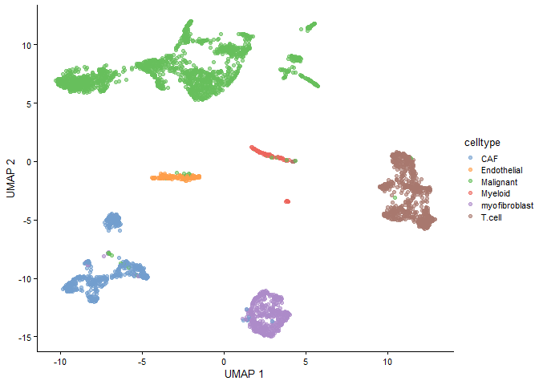<!-- -->

``` r
scater::plotReducedDim(sce, dimred = "UMAP", colour_by = "tumor")
```

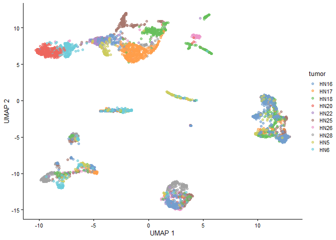<!-- -->

``` r
scater::plotReducedDim(sce, dimred = "UMAP", colour_by = "pEMT")
```

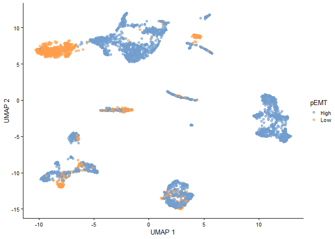<!-- -->

``` r
scater::plotReducedDim(sce, dimred = "UMAP", colour_by = "pEMT_fine")
```

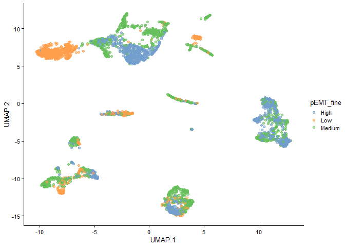<!-- -->

We will also look at at a potential covariate/batch effect of interest.
For this dataset, no batch effect was known. Therefore we will simulate
a mock batch, just to demosntrate the code. (In the future, we will use
another example dataset in this vignette.)

``` r
set.seed(1919)
sample_id = "tumor"
extra_metadata = SummarizedExperiment::colData(sce)  %>% tibble::as_tibble()  %>% dplyr::select(all_of(sample_id)) %>% dplyr::distinct() %>% mutate(batch = sample(c("A","B"),nrow(.), replace = TRUE))
new_metadata = SummarizedExperiment::colData(sce)  %>% tibble::as_tibble()  %>% inner_join(extra_metadata)
new_metadata = new_metadata %>% data.frame()
rownames(new_metadata) = new_metadata$cell

sce = SingleCellExperiment::SingleCellExperiment(list(counts=SingleCellExperiment::counts(sce), logcounts=SingleCellExperiment::logcounts(sce)),
                                                 reducedDims = SingleCellExperiment::reducedDims(sce),
                                                 colData=new_metadata,
                                                 rowData=SingleCellExperiment::rowData(sce),
                                                 metadata=sce@metadata
)
scater::plotReducedDim(sce, dimred = "UMAP", colour_by = "batch")
```

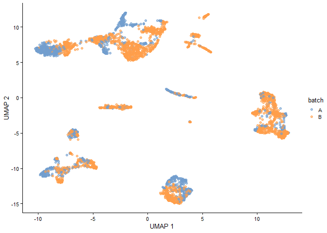<!-- -->

Now we will define in which metadata columns we can find the **group**,
**sample**, **cell type** and **covariates** IDs

For the group\_id in this vignette, we choose the ‘pEMT’ column instead
of ‘pEMT\_fine’.

``` r
sample_id = "tumor"
group_id = "pEMT"
celltype_id = "celltype"
covariates = "batch"
```

Now we will go to the first real step of the muscat analysis

# Step 1: Check cell type abundance

## Step 1a: Number of cells per celltype-sample combination

We will now check the number of cells per cell type condition
combination, and the number of patients per condition. This is important
because muscat performs pseudobulking to infer group differences at the
sample level for each cell type. This means that we will group the
information of all cells of a cell type in a sample together to get 1
sample-celltype estimate. The more cells we have, the more accurate this
aggregated expression measure will be.

``` r
table(SummarizedExperiment::colData(sce)$celltype, SummarizedExperiment::colData(sce)$tumor) # cell types vs samples
##                
##                 HN16 HN17 HN18 HN20 HN22 HN25 HN26 HN28 HN5 HN6
##   CAF             47   37   36    3    9   73   19  157  37  82
##   Endothelial     43   17   18    1    1    1    0   14  11  52
##   Malignant       82  353  263  331  123  153   61   49  70 157
##   Myeloid         15    2    7    0    1    8    1    1  58   6
##   myofibroblast   84    6   14   10   45   88   45  140   5   6
##   T.cell         300   61  207    0    0   93    3    0  28   0
table(SummarizedExperiment::colData(sce)$celltype, SummarizedExperiment::colData(sce)$pEMT) # cell types vs conditions
##                
##                 High  Low
##   CAF            396  104
##   Endothelial    105   53
##   Malignant     1093  549
##   Myeloid         92    7
##   myofibroblast  382   61
##   T.cell         689    3
table(SummarizedExperiment::colData(sce)$tumor, SummarizedExperiment::colData(sce)$pEMT) # samples vs conditions
##       
##        High Low
##   HN16  571   0
##   HN17  476   0
##   HN18  545   0
##   HN20    0 345
##   HN22  179   0
##   HN25  416   0
##   HN26    0 129
##   HN28  361   0
##   HN5   209   0
##   HN6     0 303
table(SummarizedExperiment::colData(sce)$tumor, SummarizedExperiment::colData(sce)$batch) # samples vs batches
##       
##          A   B
##   HN16   0 571
##   HN17   0 476
##   HN18   0 545
##   HN20 345   0
##   HN22   0 179
##   HN25 416   0
##   HN26   0 129
##   HN28 361   0
##   HN5  209   0
##   HN6    0 303
```

As you can see in the upper table, some Celltype-Sample combinations
have 0 cells. It is possible that during DE analysis, some cell types
will be removed from the analysis if there is not enough information to
do a DE analysis. (More info later)

We can define the minimum number of cells we require per celltype-sample
combination. It is recommened to have at least 10 (and preferably more)
cells in each sample-celltype combination. Therefore we will set the
`min_cells` parameter in the analysis to 10. Celltype-sample
combinations with less cells will not be considered during the muscat DS
analysis.

``` r
min_cells = 10
```

We will now calculate the cell type abundance table and make the
visualizations:

``` r
abundance_output = get_abundance_info(sce, sample_id, group_id, celltype_id, min_cells, covariates = covariates)
head(abundance_output$abundance_data)
## # A tibble: 6 x 7
## # Groups:   sample_id, celltype_id [6]
##   sample_id celltype_id       n group_covariate_id keep  group_id covariate_oi
##   <chr>     <chr>         <int> <chr>              <fct> <chr>    <fct>       
## 1 HN16      CAF              47 High_B             TRUE  High     B           
## 2 HN16      Endothelial      43 High_B             TRUE  High     B           
## 3 HN16      Malignant        82 High_B             TRUE  High     B           
## 4 HN16      Myeloid          15 High_B             TRUE  High     B           
## 5 HN16      myofibroblast    84 High_B             TRUE  High     B           
## 6 HN16      T.cell          300 High_B             TRUE  High     B
```

To visually see which celltype-sample combinations won’t be considered,
you can run the following code:

``` r
abundance_output$abund_plot_sample
```

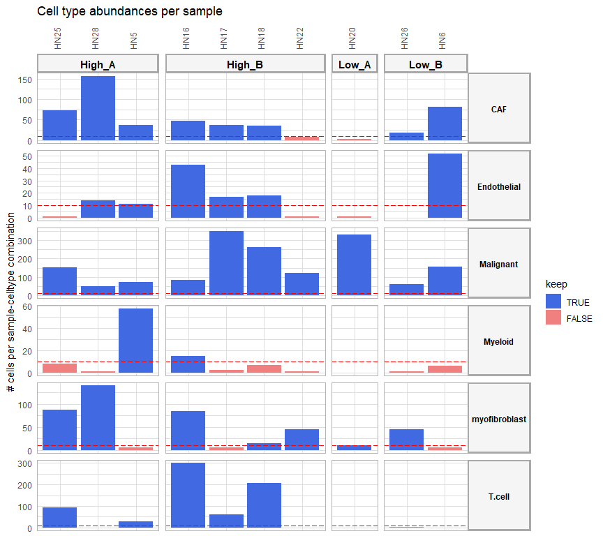<!-- -->

Note: each group is here split into its batches as well!

Celltype-sample combinations that won’t be considered are indicated in
red (because they have less cells than the `min_cells` threshold
indicated by the red dashed line)

If too many celltype-sample combinations don’t pass this threshold, we
recommend to define your cell types in a more general way it this would
still be possible and make sense biologically (–&gt; use one level
higher of the cell type ontology hierarchy; eg TH17 CD4T cells –&gt;
CD4T cells \| but not myeloid + T.cell together).

We can see here that quite many sample-celltype combinations are left
out. For Endothelial, Myeloid, and T cells, we don’t even have two or
more samples in each group that have enough cells of those cell types.
When we don’t have two or more samples per group left, we cannot do a
group comparison (we need at least 2 replicates per group for a
statistical analysis). Therefore, those cell types will be removed
before the DE analysis.

As stated before when seeing this, we would recommend to use a
higher-level cell type annotation if possible. But the annotation here
is already high-level, and grouping Endothelial cells, T cells and
Myeloid cells eg would not make sense biologically. That we won’t be
able to include these cell types in our analysis is a limitation of the
muscat approach compared to classic cell-level-based approaches (like
Seurat::FindMarkers). On the contrary, those cell-level-based approaches
don’t reveal the lack of cells in many samples, and might lead to biased
results.

## Step 1b: Differential cell type abundance between the groups of interest

In another visualization, we can compare the cell type abundances
between the groups of interest. This can be interesting because too
strong abundance differences might have an effect on the DS analysis.
Downstream results of these cell types should then be considered with
some caution.

``` r
abundance_output$abund_plot_group
```

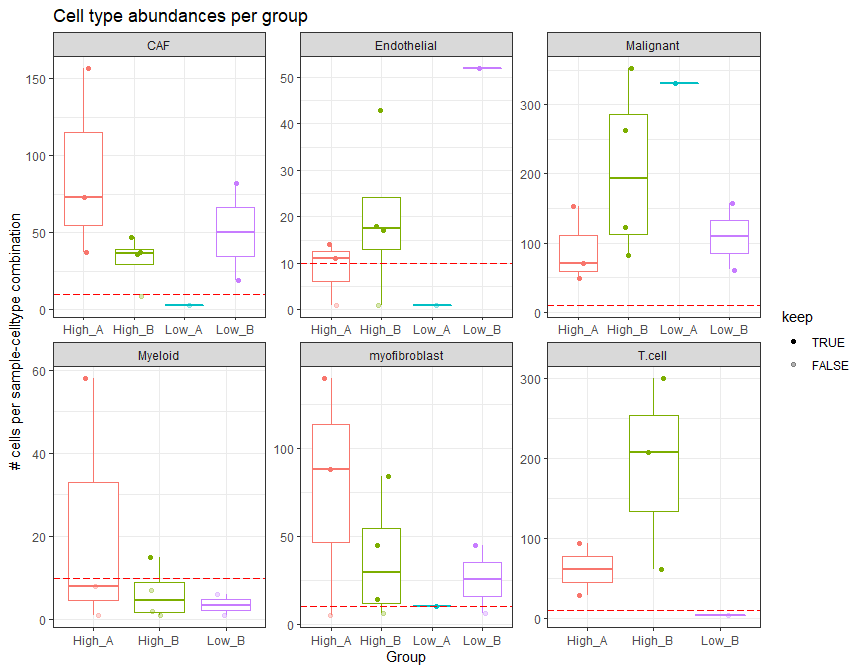<!-- -->

Note: each group is here split into its batches as well!

Differential abundance looks quite OK for the cell types kept for the DE
analysis (i.e. CAF, Malignant and myofibroblast)

We can also look at cell type proportions per sample, and compare this
between the different groups

``` r
abundance_output$abund_barplot
```

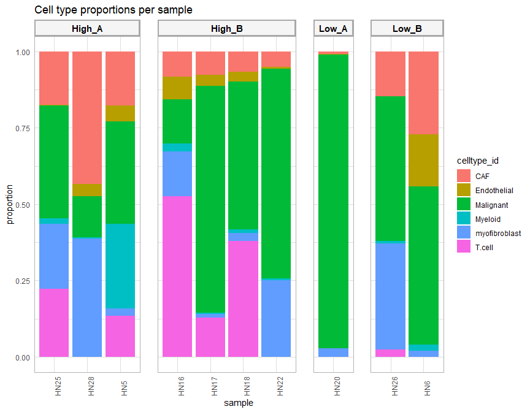<!-- -->

Note: each group is here split into its batches as well!

### Conclusion of this step:

**Important**: Based on the cell type abundance diagnostics, we
recommend users to change their analysis settings if required, before
proceeding with the rest of the analysis.

# Step 2: Perform genome-wide differential expression analysis

Now we will go over to the multi-group, multi-sample differential
expression (DE) analysis (also called ‘differential state’ analysis by
the developers of Muscat).

### Define the contrasts and covariates of interest for the DE analysis.

Here, we want to compare the p-EMT-high vs the p-EMT-low group and find
genes that are differentially expressed in high vs low pEMT. We don’t
have other covariates to correct for in this dataset. If you would have
covariates you can correct for, we recommend doing this.

#### about contrasts and how to set them:

Note the format to indicate the contrasts! (This formatting should be
adhered to very strictly, and white spaces are not allowed)

``` r
contrasts_oi = c("'High-Low','Low-High'")
contrast_tbl = tibble(contrast = 
                        c("High-Low","Low-High"), 
                      group = c("High","Low"))
```

### Perform the DE analysis for each cell type.

``` r
muscat_output = muscat_analysis(
     sce = sce,
     celltype_id = celltype_id,
     sample_id = sample_id,
     group_id = group_id,
     covariates = covariates,
     contrasts_oi = contrasts_oi,
     contrast_tbl = contrast_tbl)
## [1] "excluded cell types are:"
## [1] "Endothelial" "Myeloid"     "T.cell"     
## [1] "These celltypes are not considered in the analysis. After removing samples that contain less cells than the required minimal, some groups don't have 2 or more samples anymore. As a result the analysis cannot be run. To solve this: decrease the number of min_cells or change your group_id and pool all samples that belong to groups that are not of interest! "
```

### Check DE results

The `muscat_output` object contains both the default output as given by
the `muscat::pbDS()` function, and a cleaner output table (through
`muscat::resDS`). It also contains a table with per gene the average
expression, the fraction of cells in a celltype expressing it, and the
pseudobulk expression: and this grouped per celltype per sample.

Table with this latter cell type info

``` r
muscat_output$celltype_info %>% lapply(head)
## $avg_df
## # A tibble: 6 x 4
##   gene     sample average_sample celltype     
##   <chr>    <chr>           <dbl> <fct>        
## 1 C9orf152 HN28            0     myofibroblast
## 2 RPS11    HN28            5.78  myofibroblast
## 3 ELMO2    HN28            0.504 myofibroblast
## 4 CREB3L1  HN28            0     myofibroblast
## 5 PNMA1    HN28            1.17  myofibroblast
## 6 MMP2     HN28            0.103 myofibroblast
## 
## $frq_df
## # A tibble: 6 x 4
##   gene     sample fraction_sample celltype     
##   <chr>    <chr>            <dbl> <chr>        
## 1 C9orf152 HN28             0     myofibroblast
## 2 RPS11    HN28             0.957 myofibroblast
## 3 ELMO2    HN28             0.157 myofibroblast
## 4 CREB3L1  HN28             0     myofibroblast
## 5 PNMA1    HN28             0.243 myofibroblast
## 6 MMP2     HN28             0.05  myofibroblast
## 
## $pb_df
## # A tibble: 6 x 4
##   gene     sample pb_sample celltype     
##   <chr>    <chr>      <dbl> <fct>        
## 1 C9orf152 HN28        0    myofibroblast
## 2 RPS11    HN28        9.49 myofibroblast
## 3 ELMO2    HN28        6.74 myofibroblast
## 4 CREB3L1  HN28        0    myofibroblast
## 5 PNMA1    HN28        6.59 myofibroblast
## 6 MMP2     HN28        3.85 myofibroblast
## 
## $avg_df_group
## # A tibble: 6 x 4
## # Groups:   group, celltype [1]
##   group celltype gene     average_group
##   <chr> <fct>    <chr>            <dbl>
## 1 High  CAF      A1BG           0.211  
## 2 High  CAF      A1BG-AS1       0.124  
## 3 High  CAF      A1CF           0.00428
## 4 High  CAF      A2M            2.68   
## 5 High  CAF      A2M-AS1        0.0882 
## 6 High  CAF      A2ML1          0.0265 
## 
## $frq_df_group
## # A tibble: 6 x 4
## # Groups:   group, celltype [1]
##   group celltype gene     fraction_group
##   <chr> <chr>    <chr>             <dbl>
## 1 High  CAF      A1BG             0.103 
## 2 High  CAF      A1BG-AS1         0.0536
## 3 High  CAF      A1CF             0.0739
## 4 High  CAF      A2M              0.500 
## 5 High  CAF      A2M-AS1          0.0447
## 6 High  CAF      A2ML1            0.207 
## 
## $pb_df_group
## # A tibble: 6 x 4
## # Groups:   group, celltype [1]
##   group celltype gene     pb_group
##   <chr> <fct>    <chr>       <dbl>
## 1 High  CAF      A1BG        3.97 
## 2 High  CAF      A1BG-AS1    2.81 
## 3 High  CAF      A1CF        0.551
## 4 High  CAF      A2M         8.04 
## 5 High  CAF      A2M-AS1     2.53 
## 6 High  CAF      A2ML1       1.98 
## 
## $rel_abundance_df
## # A tibble: 6 x 3
##   group celltype    rel_abundance_scaled
##   <chr> <chr>                      <dbl>
## 1 High  CAF                        0.518
## 2 Low   CAF                        0.482
## 3 High  Endothelial                0.358
## 4 Low   Endothelial                0.642
## 5 High  Malignant                  0.359
## 6 Low   Malignant                  0.641
```

Table with logFC and p-values for each gene-celltype-contrast:

``` r
muscat_output$celltype_de$celltype_de$de_output_tidy %>% arrange(p_adj) %>% head()
## # A tibble: 6 x 9
##   gene    cluster_id  logFC logCPM     F       p_val p_adj.loc   p_adj contrast
##   <chr>   <chr>       <dbl>  <dbl> <dbl>       <dbl>     <dbl>   <dbl> <chr>   
## 1 CT45A3  Malignant  -10.1    5.18 120   0.000000239   0.00193 0.00453 High-Low
## 2 CT45A1  Malignant   -9.77   4.98 118   0.00000026    0.00193 0.00453 High-Low
## 3 CT45A3  Malignant   10.1    5.18 120   0.000000239   0.00193 0.00453 Low-High
## 4 CT45A1  Malignant    9.77   4.98 118   0.00000026    0.00193 0.00453 Low-High
## 5 JAKMIP3 Malignant   -7.44   2.77  78.4 0.00000207    0.00495 0.0116  High-Low
## 6 CIB1    Malignant    1.18   8.11  76.6 0.00000233    0.00495 0.0116  High-Low
```

Observe that the top gene here is different than in the analysis without
batch effect correction [Multi-sample Multi-condition Differential
Expression Analysis via Muscat: HNSCC
application](basic_analysis.md):`vignette("basic_analysis", package="muscatWrapper")`

We can also show the distribution of the p-values:

``` r
muscat_output$celltype_de$hist_pvals
```

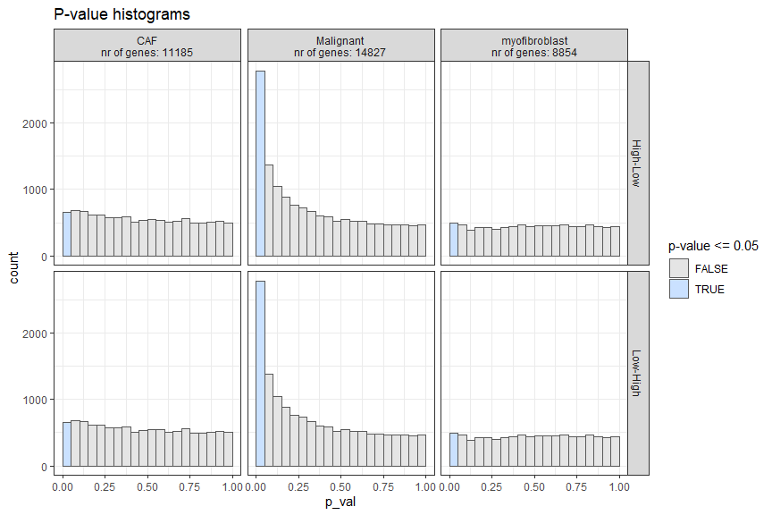<!-- -->

(Note: this p-value histograms are the same for High-Low and Low-High
because we only have two groups and compare them to each other - a DE
gene in one comparison will then also be DE in the other comparison,
with just a reversed sign of the logFC)

In order to trust the p-values, the p-value distributions should be
uniform distributions, with a peak allowed between 0 and 0.05 if there
would be a clear biological effect in the data. This clear effect
(=clear DE) seems to be present here in the Malignant cell type
populations, although the histogram is not very uniformly distributed
for p-values between 0.05 and 0.25. This might point to issues in the DE
model definition. Most common issues occur when we did not add all
important covariates to the model, or when there is substructure
present: meaning that one of the groups is actually a combination of
multiple groups.

# Step 3: Downstream analysis and visualization

Visualize the expression of some DE genes: here as example: genes higher
in the pEMT high tumors in the Malignant cell type

``` r
celltype_oi = "Malignant"
group_oi = "High"

DE_genes = muscat_output$celltype_de$celltype_de$de_output_tidy  %>% inner_join(contrast_tbl) %>% filter(group == group_oi) %>% filter(cluster_id == celltype_oi) %>% filter(p_adj <= 0.05 & logFC >= 1) %>% arrange(p_adj) %>% pull(gene) %>% unique()
DE_genes
##  [1] "CIB1"    "RAB31"   "AGTRAP"  "GSDMC"   "AHNAK2"  "ITGA3"   "ANXA8L1" "ITGB6"   "S100A2"  "GPR68"   "ITGB1"   "KRT16"   "GALNT6"  "INHBA"   "ACTN1"   "PDLIM7"  "CA2"     "KCNK6"  
## [19] "PLEK2"   "GBP3"    "ANXA8L2" "PDGFC"   "SAMD9L"  "MT1L"    "SLC31A2" "IL20RB"  "SERINC2" "ATP6V1D" "CSPG4"   "RAB38"   "GJB6"    "THSD1"   "EREG"    "EHD2"    "COL17A1" "CAV1"   
## [37] "IL20"    "MMP1"    "LTBP1"   "GALE"    "GNAI1"
```

(Note 1 : Due to the pseudoubulking, single-cell level information is
lost and Muscat can be underpowered. Therefore it is possible that are
sometimes no significant DE genes after multiple testing correction. In
that case, using less stringent cutoffs is better)

(Note 2 : If having a few samples per group (&lt;5), it is likely that
some DE genes will be driven by an outlier sample. Therefore it is
always necessary to visualize the expression of the DE genes in the
violin and dotplots shown here)

First, make a violin plot

``` r
gene_oi = DE_genes[1]

violin_plot = make_DEgene_violin_plot(sce = sce, gene_oi = gene_oi, celltype_oi = celltype_oi, group_id = group_id, sample_id = sample_id, celltype_id = celltype_id, covariate_oi = covariates)
violin_plot
```

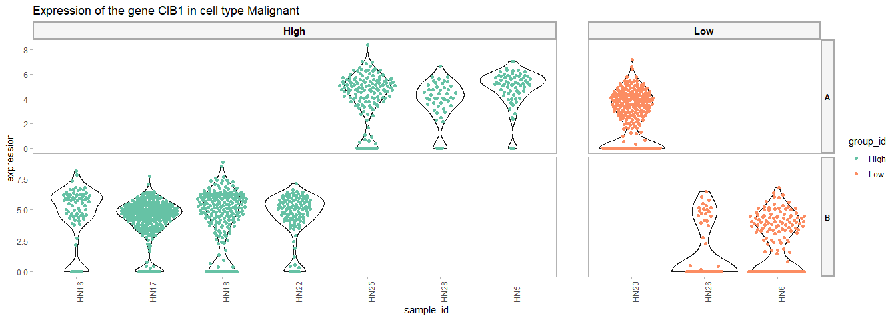<!-- -->

Then a Dotplot

``` r
dotplots = make_DEgene_dotplot_pseudobulk_covariate(genes_oi = DE_genes, celltype_info = muscat_output$celltype_info, abundance_data = abundance_output$abundance_data, celltype_oi = celltype_oi, covariate_oi = covariates)
dotplots$pseudobulk_plot 
```

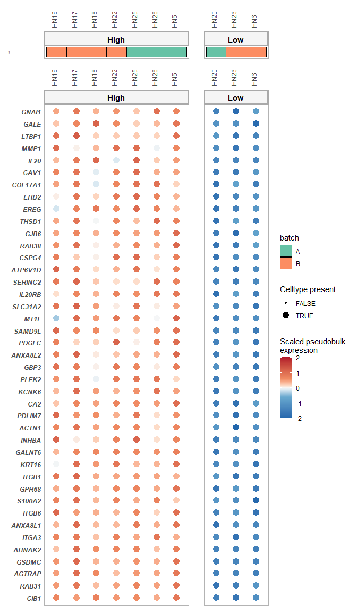<!-- -->

``` r
dotplots$singlecell_plot
```

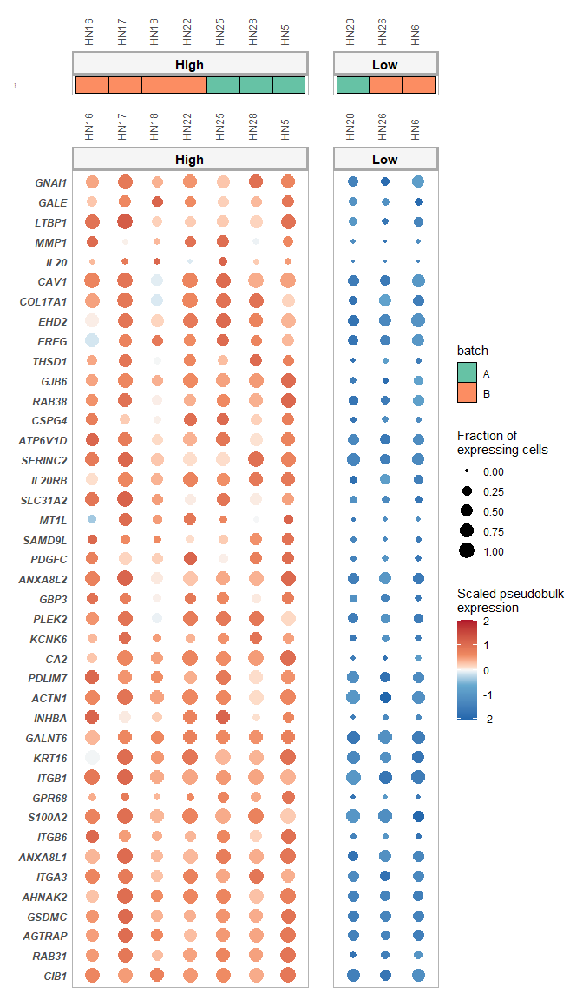<!-- -->

# Step 4: Exploring the effect of the batch effect correction

## Run the analysis without batch effect correction

This is needed to compare the results with the bach-effect-correction
analysis performed before in this vignette

``` r
covariates_uncorrected = NA

abundance_output_uncorrected = get_abundance_info(sce, sample_id, group_id, celltype_id, min_cells, covariates = covariates_uncorrected)

muscat_output_uncorrected = muscat_analysis(
     sce = sce,
     celltype_id = celltype_id,
     sample_id = sample_id,
     group_id = group_id,
     covariates = covariates_uncorrected,
     contrasts_oi = contrasts_oi,
     contrast_tbl = contrast_tbl)
## [1] "excluded cell types are:"
## [1] "Endothelial" "Myeloid"     "T.cell"     
## [1] "These celltypes are not considered in the analysis. After removing samples that contain less cells than the required minimal, some groups don't have 2 or more samples anymore. As a result the analysis cannot be run. To solve this: decrease the number of min_cells or change your group_id and pool all samples that belong to groups that are not of interest! "
```

## Find genes with strongest batch effect correction coefficient in the statistical model

``` r
coef_df = muscat_output$celltype_de$celltype_de$de_output$fit[[celltype_oi]]$coefficients %>% as.data.frame() %>% tibble::rownames_to_column("gene") %>% tibble::as_tibble()
head(coef_df)
## # A tibble: 6 x 4
##   gene      High    Low ei.batchB
##   <chr>    <dbl>  <dbl>     <dbl>
## 1 RPS11    -7.66  -7.67   0.0379 
## 2 ELMO2    -9.77  -9.89  -0.00160
## 3 CREB3L1 -13.5  -14.9    2.22   
## 4 PNMA1    -9.75  -9.37  -0.291  
## 5 MMP2     -9.25 -11.2    0.184  
## 6 TMEM216  -9.71  -9.46  -0.188
```

Sort the genes based on the covariate effect

``` r
coef_df %>% arrange(-ei.batchB) %>% head()
## # A tibble: 6 x 4
##   gene     High   Low ei.batchB
##   <chr>   <dbl> <dbl>     <dbl>
## 1 VGLL1   -17.9 -16.1      4.94
## 2 CXCL5   -16.0 -17.0      4.86
## 3 SPRR3   -16.8 -16.6      4.82
## 4 CRYM    -16.3 -17.0      4.66
## 5 SNAR-G1 -17.6 -16.2      4.51
## 6 PSG4    -14.8 -16.5      4.46
coef_df %>% arrange(ei.batchB) %>% head()
## # A tibble: 6 x 4
##   gene       High    Low ei.batchB
##   <chr>     <dbl>  <dbl>     <dbl>
## 1 GAGE7    -10.8   -7.03     -4.05
## 2 GAGE5    -12.0   -9.02     -3.33
## 3 NLRP2     -9.55  -8.85     -3.25
## 4 SLURP1   -11.4  -16.1      -3.14
## 5 C1orf110 -12.8   -8.25     -3.07
## 6 PNLIPRP3 -10.2  -16.2      -2.78
```

In the case your covariate corresponds to a well-known effect, such as
biological sex, you will see genes relevant for this process pop up in
this list (eg Y chromosome genes for the sex covariate)

Interpretation of these values: if value of the ei.batchB coefficient is
positive: higher expression in batch B, if negative: higher expression
in batch A.

We will save the top10 genes with highest coefficient values in both
directions

``` r
top_A_genes = coef_df %>% arrange(ei.batchB) %>% head(10) %>% pull(gene)
top_B_genes = coef_df %>% arrange(-ei.batchB) %>% head(10) %>% pull(gene)
```

## Merge DE table of analysis with and without batch effect correction

And compare the “uncorrected logFC” between the groups of interest with
the “corrected logFC”

``` r
muscat_output_joined = muscat_output_uncorrected$celltype_de$celltype_de$de_output_tidy %>% distinct(gene, cluster_id, logFC, p_adj, contrast) %>% rename(logFC_uncorrected = logFC, p_adj_uncorrected = p_adj) %>% inner_join(
  muscat_output$celltype_de$celltype_de$de_output_tidy %>% distinct(gene, cluster_id, logFC, p_adj, contrast) %>% rename(logFC_corrected = logFC, p_adj_corrected = p_adj)
) %>% mutate(diff_logFC = logFC_corrected - logFC_uncorrected)

muscat_output_joined %>% arrange(-abs(diff_logFC)) %>% filter(cluster_id == celltype_oi)
## # A tibble: 27,894 x 8
##    gene    cluster_id logFC_uncorrected p_adj_uncorrected contrast logFC_corrected p_adj_corrected diff_logFC
##    <chr>   <chr>                  <dbl>             <dbl> <chr>              <dbl>           <dbl>      <dbl>
##  1 MCIN    Malignant             -0.944             0.914 High-Low           -3.66           0.437      -2.72
##  2 MCIN    Malignant              0.944             0.914 Low-High            3.66           0.437       2.72
##  3 CST1    Malignant             -2.08              0.794 High-Low           -4.63           0.516      -2.55
##  4 CST1    Malignant              2.08              0.794 Low-High            4.63           0.516       2.55
##  5 GAGE12D Malignant             -0.172             0.994 High-Low           -2.58           0.789      -2.41
##  6 GAGE12D Malignant              0.172             0.994 Low-High            2.58           0.789       2.41
##  7 DPT     Malignant              1.14              0.906 High-Low           -1.05           0.879      -2.19
##  8 DPT     Malignant             -1.14              0.906 Low-High            1.05           0.879       2.19
##  9 HSPA7   Malignant              3.72              0.479 High-Low            1.55           0.742      -2.17
## 10 HSPA7   Malignant             -3.72              0.479 Low-High           -1.55           0.742       2.17
## # ... with 27,884 more rows
```

Check now also the DE analysis results and difference for the top A/B
genes

``` r
muscat_output_joined %>% arrange(-abs(diff_logFC)) %>% filter(cluster_id == celltype_oi) %>% filter(gene %in% top_A_genes)
## # A tibble: 10 x 8
##    gene     cluster_id logFC_uncorrected p_adj_uncorrected contrast logFC_corrected p_adj_corrected diff_logFC
##    <chr>    <chr>                  <dbl>             <dbl> <chr>              <dbl>           <dbl>      <dbl>
##  1 MCIN     Malignant             -0.944             0.914 High-Low           -3.66          0.437      -2.72 
##  2 MCIN     Malignant              0.944             0.914 Low-High            3.66          0.437       2.72 
##  3 SUSD3    Malignant             -1.04              0.899 High-Low           -3.02          0.435      -1.98 
##  4 SUSD3    Malignant              1.04              0.899 Low-High            3.02          0.435       1.98 
##  5 NLRP2    Malignant             -0.131             0.994 High-Low           -1.02          0.846      -0.889
##  6 NLRP2    Malignant              0.131             0.994 Low-High            1.02          0.846       0.889
##  7 P2RY6    Malignant              1.18              0.877 High-Low            1.62          0.514       0.44 
##  8 P2RY6    Malignant             -1.18              0.877 Low-High           -1.62          0.514      -0.44 
##  9 PNLIPRP3 Malignant              8.28              0.223 High-Low            8.66          0.0792      0.380
## 10 PNLIPRP3 Malignant             -8.28              0.223 Low-High           -8.66          0.0792     -0.380
muscat_output_joined %>% arrange(-abs(diff_logFC)) %>% filter(cluster_id == celltype_oi) %>% filter(gene %in% top_B_genes)
## # A tibble: 8 x 8
##   gene    cluster_id logFC_uncorrected p_adj_uncorrected contrast logFC_corrected p_adj_corrected diff_logFC
##   <chr>   <chr>                  <dbl>             <dbl> <chr>              <dbl>           <dbl>      <dbl>
## 1 CXCL5   Malignant              1.59              0.904 High-Low           1.36            0.842   -0.23   
## 2 CXCL5   Malignant             -1.59              0.904 Low-High          -1.36            0.842    0.23   
## 3 RANBP17 Malignant             -0.606             0.964 High-Low          -0.412           0.96     0.194  
## 4 RANBP17 Malignant              0.606             0.964 Low-High           0.412           0.96    -0.194  
## 5 PSG4    Malignant              2.51              0.793 High-Low           2.45            0.602   -0.0600 
## 6 PSG4    Malignant             -2.51              0.793 Low-High          -2.45            0.602    0.0600 
## 7 SPRR3   Malignant             -0.431             0.977 High-Low          -0.428           0.962    0.00300
## 8 SPRR3   Malignant              0.431             0.977 Low-High           0.428           0.962   -0.00300
```

Check now also once the batch coefficients for the genes with strongest
logFC differences

``` r
top_diff_genes = muscat_output_joined %>% arrange(-abs(diff_logFC)) %>% filter(cluster_id == celltype_oi) %>% pull(gene) %>% head(20) %>% unique()
coef_df %>% filter(gene %in% top_diff_genes) # we see indeed quite high Batch coefficient values
## # A tibble: 10 x 4
##    gene      High    Low ei.batchB
##    <chr>    <dbl>  <dbl>     <dbl>
##  1 CPXM1   -11.3  -10.8      -2.06
##  2 GAGE4   -10.3   -8.10     -1.94
##  3 COL10A1 -12.2  -11.0      -2.03
##  4 DPT     -11.1  -10.4      -1.98
##  5 GAGE12D -10.3   -8.53     -2.19
##  6 HSPA7    -9.72 -10.8      -2.41
##  7 CST1    -12.9   -9.74     -2.38
##  8 TDO2    -13.1   -9.48     -2.33
##  9 SUSD3   -12.0   -9.87     -2.62
## 10 MCIN    -12.4   -9.91     -2.75
```

And define a list of genes that are more clearly DE without batch effect
correction than with

``` r
DE_without_cor = muscat_output_joined %>% arrange(diff_logFC) %>% filter(cluster_id == celltype_oi) %>% filter(contrast == "High-Low")  %>% filter(logFC_corrected < logFC_uncorrected) %>% filter(logFC_uncorrected > 1) %>% pull(gene) %>% head(10) %>% unique()
coef_df %>% filter(gene %in% DE_without_cor) # we see indeed quite high Batch coefficient values
## # A tibble: 10 x 4
##    gene         High    Low ei.batchB
##    <chr>       <dbl>  <dbl>     <dbl>
##  1 CPXM1      -11.3  -10.8      -2.06
##  2 NCRNA00185 -14.2  -14.7       1.95
##  3 RSAD2       -9.64  -9.81     -1.23
##  4 BGN         -8.66 -10.2      -1.30
##  5 PRR4       -11.5  -11.5       1.33
##  6 GIMAP2     -10.8  -12.1      -1.22
##  7 DPT        -11.1  -10.4      -1.98
##  8 SCG5       -10.8  -11.2      -1.44
##  9 GLDC       -12.2  -12.3       1.13
## 10 HSPA7       -9.72 -10.8      -2.41
```

## Visualization of the batch effect correction

### Show expression of these top-batch-effect-correction effected genes: with **non-corrected** pseudobulkexpression values

``` r
dotplots_topA = make_DEgene_dotplot_pseudobulk_covariate(genes_oi = top_A_genes, celltype_info = muscat_output_uncorrected$celltype_info, abundance_data = abundance_output$abundance_data, celltype_oi = celltype_oi, covariate_oi = covariates)
dotplots_topA$pseudobulk_plot 
```

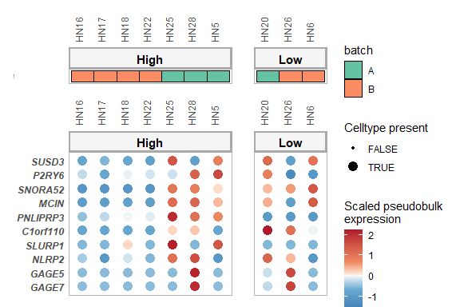<!-- -->

As can be expected if we show non-corrected values, higher expression of
topA genes in A-samples can be observed. The same is true for the B
genes:

``` r
dotplots_topB = make_DEgene_dotplot_pseudobulk_covariate(genes_oi = top_B_genes, celltype_info = muscat_output_uncorrected$celltype_info, abundance_data = abundance_output$abundance_data, celltype_oi = celltype_oi, covariate_oi = covariates)
dotplots_topB$pseudobulk_plot 
```

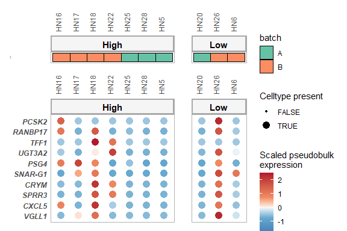<!-- -->

Now: visualize the expression of the genes that are more clearly DE
(high in pEMT-high group) without correction than with

``` r
dotplots_DE_without_cor = make_DEgene_dotplot_pseudobulk_covariate(genes_oi = DE_without_cor, celltype_info = muscat_output_uncorrected$celltype_info, abundance_data = abundance_output$abundance_data, celltype_oi = celltype_oi, covariate_oi = covariates)
dotplots_DE_without_cor$pseudobulk_plot 
```

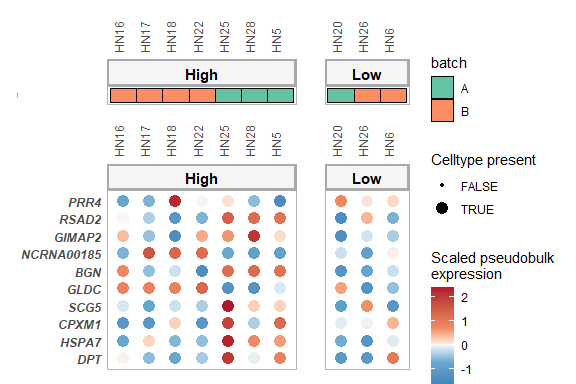<!-- -->

### Show expression of these top-batch-effect-correction effected genes: with **corrected** pseudobulkexpression values (default plot of muscatWrapper)

``` r
dotplots_topA = make_DEgene_dotplot_pseudobulk_covariate(genes_oi = top_A_genes, celltype_info = muscat_output$celltype_info, abundance_data = abundance_output$abundance_data, celltype_oi = celltype_oi, covariate_oi = covariates)
dotplots_topA$pseudobulk_plot 
```

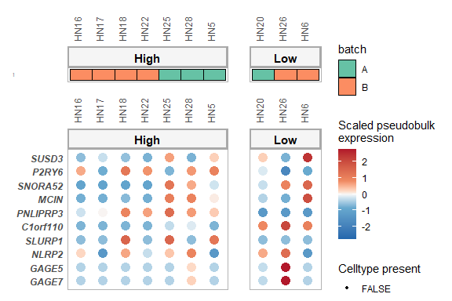<!-- -->

In the original expression space, these genes have clearly higher
expression in batch A samples. However, we can see that after batch
correction, this effect is not visible anymore. The batch effect
correction had its effect.

This is less clear though for the B genes:

``` r
dotplots_topB = make_DEgene_dotplot_pseudobulk_covariate(genes_oi = top_B_genes, celltype_info = muscat_output$celltype_info, abundance_data = abundance_output$abundance_data, celltype_oi = celltype_oi, covariate_oi = covariates)
dotplots_topB$pseudobulk_plot 
```

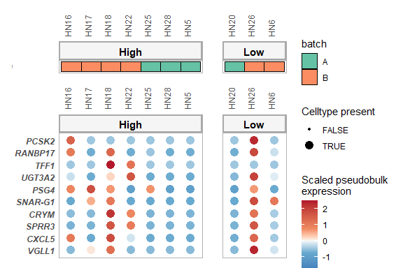<!-- -->

Now: visualize the expression of the genes that are more clearly DE
(high in pEMT-high group) without correction than with

``` r
dotplots_DE_without_cor = make_DEgene_dotplot_pseudobulk_covariate(genes_oi = DE_without_cor, celltype_info = muscat_output$celltype_info, abundance_data = abundance_output$abundance_data, celltype_oi = celltype_oi, covariate_oi = covariates)
dotplots_DE_without_cor$pseudobulk_plot 
```

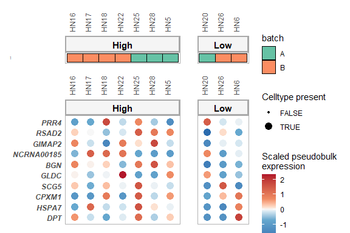<!-- -->

In contrast to the visualization without correction, these genes are
less clearly higher in the p-EMT group

## References

Crowell, H.L., Soneson, C., Germain, PL. et al. muscat detects
subpopulation-specific state transitions from multi-sample
multi-condition single-cell transcriptomics data. Nat Commun 11, 6077
(2020). <https://doi.org/10.1038/s41467-020-19894-4>

Puram, Sidharth V., Itay Tirosh, Anuraag S. Parikh, Anoop P. Patel,
Keren Yizhak, Shawn Gillespie, Christopher Rodman, et al. 2017.
“Single-Cell Transcriptomic Analysis of Primary and Metastatic Tumor
Ecosystems in Head and Neck Cancer.” Cell 171 (7): 1611–1624.e24.
<https://doi.org/10.1016/j.cell.2017.10.044>.
