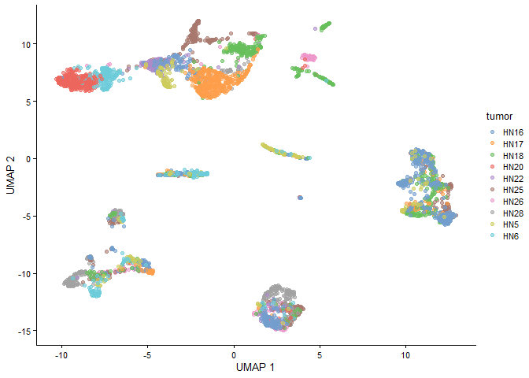
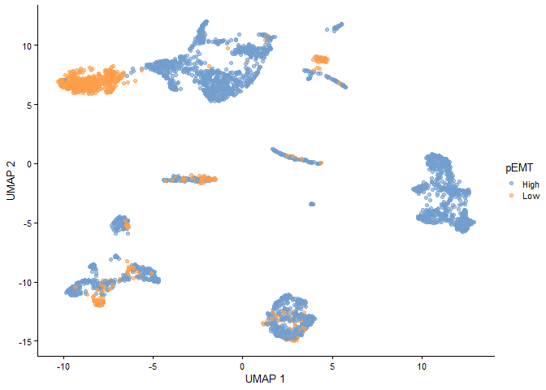
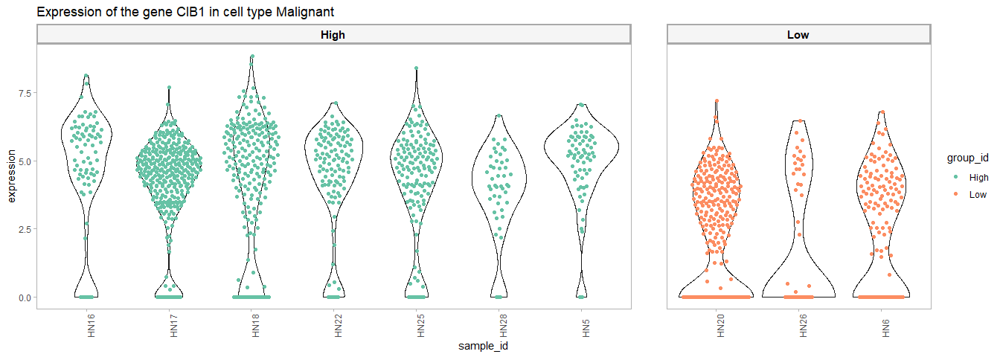
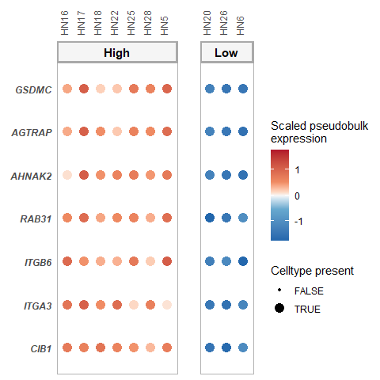
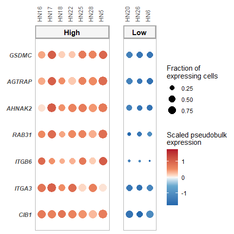

Multi-sample Multi-condition Differential Expression Analysis via
Muscat: HNSCC application – Empirical Null procedure
================
Robin Browaeys
2021-12-13

<!-- github markdown built using 
rmarkdown::render("vignettes/basic_analysis_empnull.Rmd", output_format = "github_document")
-->

In this vignette, you can learn how to perform a muscat differential
state (DS) analysis. A DS analysis can be performed if you have
multi-sample, multi-group single-cell data. For each cell type of
interest, muscat will compare the sample-wise expression of all genes
between groups of interest. Therefore, the absolute minimum of meta data
you need to have, are following columns indicating for each cell: the
**group**, **sample** and **cell type**.

As example expression data, we will use data from Puram et al. of the
tumor microenvironment in head and neck squamous cell carcinoma (HNSCC)
\[See @puram_single-cell_2017\]
[](https://doi.org/10.5281/zenodo.5196144).
The groups we have here are tumors scoring high for a partial
epithelial-mesenschymal transition (p-EMT) program vs low-scoring
tumors.

The different steps of the MultiNicheNet analysis are the following:

- 0.  Preparation of the analysis: load packages, read in the
      single-cell expression data, and define the main settings of the
      muscat analysis

- 1.  Check cell type abundance for the cell types of interest

- 2.  Perform genome-wide differential expression (DS) analysis

- 3.  Downstream analysis of the DS output, including visualization

In this vignette, we will demonstrate all these steps in detail.

# Step 0: Preparation of the analysis: load packages, read in the single-cell expression data, and define the main settings of the muscat analysis

IMPORTANT: The current implementation of the muscat wrapper starts from
a SingleCellExperiment object, therefore we will need to load the
SingleCellExperiment library. If you start from a Seurat object, you can
convert it easily to a SingleCellExperiment via
`sce = Seurat::as.SingleCellExperiment(seurat_obj, assay = "RNA")`.

``` r
library(SingleCellExperiment)
library(dplyr)
library(ggplot2)
library(muscatWrapper)
```

In this case study, we want to study differences in expression between
pEMT-high and pEMT-low tumors. The meta data columns that indicate the
pEMT status of tumors are ‘pEMT’ and ‘pEMT_fine’, cell type is indicated
in the ‘celltype’ column, and the sample is indicated by the ‘tumor’
column.

``` r
sce = readRDS(url("https://zenodo.org/record/5196144/files/sce_hnscc.rds"))
scater::plotReducedDim(sce, dimred = "UMAP", colour_by = "celltype")
```

<!-- -->

``` r
scater::plotReducedDim(sce, dimred = "UMAP", colour_by = "tumor")
```

<!-- -->

``` r
scater::plotReducedDim(sce, dimred = "UMAP", colour_by = "pEMT")
```

<!-- -->

``` r
scater::plotReducedDim(sce, dimred = "UMAP", colour_by = "pEMT_fine")
```

<!-- -->

Now we will define in which metadata columns we can find the **group**,
**sample** and **cell type** IDs

For the group_id in this vignette, we choose the ‘pEMT’ column instead
of ‘pEMT_fine’.

``` r
sample_id = "tumor"
group_id = "pEMT"
celltype_id = "celltype"
```

Now we will go to the first real step of the muscat analysis

# Step 1: Check cell type abundance

## Step 1a: Number of cells per celltype-sample combination

We will now check the number of cells per cell type condition
combination, and the number of patients per condition. This is important
because muscat performs pseudobulking to infer group differences at the
sample level for each cell type. This means that we will group the
information of all cells of a cell type in a sample together to get 1
sample-celltype estimate. The more cells we have, the more accurate this
aggregated expression measure will be.

``` r
table(SummarizedExperiment::colData(sce)$celltype, SummarizedExperiment::colData(sce)$tumor) # cell types vs samples
##                
##                 HN16 HN17 HN18 HN20 HN22 HN25 HN26 HN28 HN5 HN6
##   CAF             47   37   36    3    9   73   19  157  37  82
##   Endothelial     43   17   18    1    1    1    0   14  11  52
##   Malignant       82  353  263  331  123  153   61   49  70 157
##   Myeloid         15    2    7    0    1    8    1    1  58   6
##   myofibroblast   84    6   14   10   45   88   45  140   5   6
##   T.cell         300   61  207    0    0   93    3    0  28   0
table(SummarizedExperiment::colData(sce)$celltype, SummarizedExperiment::colData(sce)$pEMT) # cell types vs conditions
##                
##                 High  Low
##   CAF            396  104
##   Endothelial    105   53
##   Malignant     1093  549
##   Myeloid         92    7
##   myofibroblast  382   61
##   T.cell         689    3
table(SummarizedExperiment::colData(sce)$tumor, SummarizedExperiment::colData(sce)$pEMT) # samples vs conditions
##       
##        High Low
##   HN16  571   0
##   HN17  476   0
##   HN18  545   0
##   HN20    0 345
##   HN22  179   0
##   HN25  416   0
##   HN26    0 129
##   HN28  361   0
##   HN5   209   0
##   HN6     0 303
```

As you can see in the upper table, some Celltype-Sample combinations
have 0 cells. It is possible that during DE analysis, some cell types
will be removed from the analysis if there is not enough information to
do a DE analysis. (More info later)

We can define the minimum number of cells we require per celltype-sample
combination. It is recommened to have at least 10 (and preferably more)
cells in each sample-celltype combination. Therefore we will set the
`min_cells` parameter in the analysis to 10. Celltype-sample
combinations with less cells will not be considered during the muscat DS
analysis.

``` r
min_cells = 10
```

We will now calculate the cell type abundance table and make the
visualizations:

``` r
abundance_output = get_abundance_info(sce, sample_id, group_id, celltype_id, min_cells, covariates = NA)
head(abundance_output$abundance_data)
## # A tibble: 6 x 5
## # Groups:   sample_id, celltype_id [6]
##   sample_id celltype_id       n group_id keep 
##   <chr>     <chr>         <int> <chr>    <fct>
## 1 HN16      CAF              47 High     TRUE 
## 2 HN16      Endothelial      43 High     TRUE 
## 3 HN16      Malignant        82 High     TRUE 
## 4 HN16      Myeloid          15 High     TRUE 
## 5 HN16      myofibroblast    84 High     TRUE 
## 6 HN16      T.cell          300 High     TRUE
```

To visually see which celltype-sample combinations won’t be considered,
you can run the following code:

``` r
abundance_output$abund_plot_sample
```

<!-- -->

Celltype-sample combinations that won’t be considered are indicated in
red (because they have less cells than the `min_cells` threshold
indicated by the red dashed line)

If too many celltype-sample combinations don’t pass this threshold, we
recommend to define your cell types in a more general way it this would
still be possible and make sense biologically (–\> use one level higher
of the cell type ontology hierarchy; eg TH17 CD4T cells –\> CD4T cells
\| but not myeloid + T.cell together).

We can see here that quite many sample-celltype combinations are left
out. For Endothelial, Myeloid, and T cells, we don’t even have two or
more samples in each group that have enough cells of those cell types.
When we don’t have two or more samples per group left, we cannot do a
group comparison (we need at least 2 replicates per group for a
statistical analysis). Therefore, those cell types will be removed
before the DE analysis.

As stated before when seeing this, we would recommend to use a
higher-level cell type annotation if possible. But the annotation here
is already high-level, and grouping Endothelial cells, T cells and
Myeloid cells eg would not make sense biologically. That we won’t be
able to include these cell types in our analysis is a limitation of the
muscat approach compared to classic cell-level-based approaches (like
Seurat::FindMarkers). On the contrary, those cell-level-based approaches
don’t reveal the lack of cells in many samples, and might lead to biased
results.

## Step 1b: Differential cell type abundance between the groups of interest

In another visualization, we can compare the cell type abundances
between the groups of interest. This can be interesting because too
strong abundance differences might have an effect on the DS analysis.
Downstream results of these cell types should then be considered with
some caution.

``` r
abundance_output$abund_plot_group
```

<!-- -->

Differential abundance looks quite OK for the cell types kept for the DE
analysis (i.e. CAF, Malignant and myofibroblast)

We can also look at cell type proportions per sample, and compare this
between the different groups

``` r
abundance_output$abund_barplot
```

<!-- -->

### Conclusion of this step:

**Important**: Based on the cell type abundance diagnostics, we
recommend users to change their analysis settings if required, before
proceeding with the rest of the analysis.

# Step 2: Perform genome-wide differential expression analysis

Now we will go over to the multi-group, multi-sample differential
expression (DE) analysis (also called ‘differential state’ analysis by
the developers of Muscat).

### Define the contrasts and covariates of interest for the DE analysis.

Here, we want to compare the p-EMT-high vs the p-EMT-low group and find
genes that are differentially expressed in high vs low pEMT. We don’t
have other covariates to correct for in this dataset. If you would have
covariates you can correct for, we recommend doing this.

#### about covariates:

Note that it is only possible to add a covariate if the different
covariate categories are present in all your groups of interest as
defined in the contrasts. Eg adding the covariate ‘sex’ is possible if
both group 1 and 2 contain male and female samples. It would not be
possible if group 2 does not contain male samples for example.

If you have paired data, meaning that you have samples in group 1 (eg
steady-state) and group 2 (eg treatment) coming from the same patient,
we strongly recommend exploiting this benefit in your experimental
design by using the patient id as covariate.

#### about contrasts and how to set them:

Note the format to indicate the contrasts! (This formatting should be
adhered to very strictly, and white spaces are not allowed)

``` r
covariates = NA
contrasts_oi = c("'High-Low','Low-High'")
contrast_tbl = tibble(contrast = 
                        c("High-Low","Low-High"), 
                      group = c("High","Low"))
```

### Perform the DE analysis for each cell type.

``` r
muscat_output = muscat_analysis(
     sce = sce,
     celltype_id = celltype_id,
     sample_id = sample_id,
     group_id = group_id,
     covariates = covariates,
     contrasts_oi = contrasts_oi,
     contrast_tbl = contrast_tbl)
## [1] "excluded cell types are:"
## [1] "Endothelial" "Myeloid"     "T.cell"     
## [1] "These celltypes are not considered in the analysis. After removing samples that contain less cells than the required minimal, some groups don't have 2 or more samples anymore. As a result the analysis cannot be run. To solve this: decrease the number of min_cells or change your group_id and pool all samples that belong to groups that are not of interest! "
```

### Check DE results

The `muscat_output` object contains both the default output as given by
the `muscat::pbDS()` function, and a cleaner output table (through
`muscat::resDS`). It also contains a table with per gene the average
expression, the fraction of cells in a celltype expressing it, and the
pseudobulk expression: and this grouped per celltype per sample.

Table with this latter cell type info

``` r
# muscat_output$celltype_info %>% lapply(head)
muscat_output$celltype_info %>% lapply(head)
## $avg_df
## # A tibble: 6 x 4
##   gene     sample average_sample celltype     
##   <chr>    <chr>           <dbl> <fct>        
## 1 C9orf152 HN28            0     myofibroblast
## 2 RPS11    HN28            5.78  myofibroblast
## 3 ELMO2    HN28            0.504 myofibroblast
## 4 CREB3L1  HN28            0     myofibroblast
## 5 PNMA1    HN28            1.17  myofibroblast
## 6 MMP2     HN28            0.103 myofibroblast
## 
## $frq_df
## # A tibble: 6 x 4
##   gene     sample fraction_sample celltype     
##   <chr>    <chr>            <dbl> <chr>        
## 1 C9orf152 HN28             0     myofibroblast
## 2 RPS11    HN28             0.957 myofibroblast
## 3 ELMO2    HN28             0.157 myofibroblast
## 4 CREB3L1  HN28             0     myofibroblast
## 5 PNMA1    HN28             0.243 myofibroblast
## 6 MMP2     HN28             0.05  myofibroblast
## 
## $pb_df
## # A tibble: 6 x 4
##   gene     sample pb_sample celltype     
##   <chr>    <chr>      <dbl> <fct>        
## 1 C9orf152 HN16        0    myofibroblast
## 2 RPS11    HN16        9.14 myofibroblast
## 3 ELMO2    HN16        6.13 myofibroblast
## 4 CREB3L1  HN16        0    myofibroblast
## 5 PNMA1    HN16        6.28 myofibroblast
## 6 MMP2     HN16        1.67 myofibroblast
## 
## $avg_df_group
## # A tibble: 6 x 4
## # Groups:   group, celltype [1]
##   group celltype gene     average_group
##   <chr> <fct>    <chr>            <dbl>
## 1 High  CAF      A1BG           0.211  
## 2 High  CAF      A1BG-AS1       0.124  
## 3 High  CAF      A1CF           0.00428
## 4 High  CAF      A2M            2.68   
## 5 High  CAF      A2M-AS1        0.0882 
## 6 High  CAF      A2ML1          0.0265 
## 
## $frq_df_group
## # A tibble: 6 x 4
## # Groups:   group, celltype [1]
##   group celltype gene     fraction_group
##   <chr> <chr>    <chr>             <dbl>
## 1 High  CAF      A1BG             0.103 
## 2 High  CAF      A1BG-AS1         0.0536
## 3 High  CAF      A1CF             0.0739
## 4 High  CAF      A2M              0.500 
## 5 High  CAF      A2M-AS1          0.0447
## 6 High  CAF      A2ML1            0.207 
## 
## $pb_df_group
## # A tibble: 6 x 4
## # Groups:   group, celltype [1]
##   group celltype gene     pb_group
##   <chr> <fct>    <chr>       <dbl>
## 1 High  CAF      A1BG        3.86 
## 2 High  CAF      A1BG-AS1    2.99 
## 3 High  CAF      A1CF        0.527
## 4 High  CAF      A2M         7.99 
## 5 High  CAF      A2M-AS1     2.55 
## 6 High  CAF      A2ML1       1.92 
## 
## $rel_abundance_df
## # A tibble: 6 x 3
##   group celltype    rel_abundance_scaled
##   <chr> <chr>                      <dbl>
## 1 High  CAF                        0.518
## 2 Low   CAF                        0.482
## 3 High  Endothelial                0.358
## 4 Low   Endothelial                0.642
## 5 High  Malignant                  0.359
## 6 Low   Malignant                  0.641
```

Table with logFC and p-values for each gene-celltype-contrast:

``` r
muscat_output$celltype_de$celltype_de$de_output_tidy %>% arrange(p_adj) %>% head()
## # A tibble: 6 x 9
##   gene    cluster_id  logFC logCPM     F       p_val p_adj.loc   p_adj contrast
##   <chr>   <chr>       <dbl>  <dbl> <dbl>       <dbl>     <dbl>   <dbl> <chr>   
## 1 JAKMIP3 Malignant   -7.37   2.76  86.5 0.000000627   0.00175 0.00426 High-Low
## 2 CT45A3  Malignant  -10.3    5.19 107   0.000000189   0.00175 0.00426 High-Low
## 3 RAB31   Malignant    3      7.02  87.2 0.000000599   0.00175 0.00426 High-Low
## 4 AGTRAP  Malignant    1.67   7.78  88.9 0.00000054    0.00175 0.00426 High-Low
## 5 CT45A6  Malignant   -7.44   2.52  93.5 0.00000041    0.00175 0.00426 High-Low
## 6 JAKMIP3 Malignant    7.37   2.76  86.5 0.000000627   0.00175 0.00426 Low-High
```

We can also show the distribution of the p-values:

``` r
muscat_output$celltype_de$hist_pvals
```

<!-- -->

(Note: this p-value histograms are the same for High-Low and Low-High
because we only have two groups and compare them to each other - a DE
gene in one comparison will then also be DE in the other comparison,
with just a reversed sign of the logFC)

In order to trust the p-values, the p-value distributions should be
uniform distributions, with a peak allowed between 0 and 0.05 if there
would be a clear biological effect in the data. This clear effect
(=clear DE) seems to be present here in the Malignant cell type
populations, although the histogram is not very uniformly distributed
for p-values between 0.05 and 0.25. This might point to issues in the DE
model definition. Most common issues occur when we did not add all
important covariates to the model, or when there is substructure
present: meaning that one of the groups is actually a combination of
multiple groups.

Because there might be some issues, and we anticipate this could be
present in other datasets, we will now use the empiricall null
procedure. This is a procedure that will define empirical p-values based
on the observed distribution of the test statistic (here: logFC) and not
based on the theoretical distribution. We only recommend this if the
p-value distributions point to possible issues. (\[ADD REFERENCE\])

### Empirical Null procedure

``` r
DE_info_emp = get_empirical_pvals(muscat_output$celltype_de$celltype_de$de_output_tidy)
```

Table with logFC and p-values for each gene-celltype-contrast:

``` r
DE_info_emp$de_output_tidy_emp %>% arrange(p_adj_emp) %>% head()
## # A tibble: 6 x 11
##   gene    cluster_id    logFC logCPM     F    p_val p_adj.loc  p_adj contrast    p_emp p_adj_emp
##   <chr>   <chr>         <dbl>  <dbl> <dbl>    <dbl>     <dbl>  <dbl> <chr>       <dbl>     <dbl>
## 1 EIF3J   myofibroblast  4.71   5.63  17   0.000832      0.45 0.106  High-Low 0.000571     0.312
## 2 SRPX    myofibroblast  3.26   6.33  19.8 0.00043       0.45 0.0823 High-Low 0.000280     0.312
## 3 NTMT1   myofibroblast  3      6.7   17.6 0.000723      0.45 0.103  High-Low 0.000491     0.312
## 4 SLC2A4  myofibroblast  2.37   7.48  19   0.000521      0.45 0.0895 High-Low 0.000345     0.312
## 5 TEKT4P2 myofibroblast  3.37   6.86  16.9 0.000858      0.45 0.108  High-Low 0.000590     0.312
## 6 FAM204A myofibroblast  2.69   6.56  17.2 0.000807      0.45 0.105  High-Low 0.000552     0.312
```

The following plot shows the distribution of these corrected, empirical
p-values:

``` r
DE_info_emp$hist_pvals_emp
```

<!-- -->

The following plots show how well the correction worked. The green
fitted curve should fit well with the histogram. If not, this might
point to some issues in the DE model definition.

``` r
DE_info_emp$z_distr_plots_emp_pval
## $`CAF.High-Low`
```

<!-- -->

    ## 
    ## $`CAF.Low-High`

<!-- -->

    ## 
    ## $`Malignant.High-Low`

<!-- -->

    ## 
    ## $`Malignant.Low-High`

<!-- -->

    ## 
    ## $`myofibroblast.High-Low`

<!-- -->

    ## 
    ## $`myofibroblast.Low-High`

<!-- -->

In general, these plots looks fine, except for the Malignant cells. As
discussed in the previous plots: there might be an issue here. One
possible explanation might be that there is additional substructure in
the data. This could make sense because the pEMT high group consists
both of pEMT very-high and pEMT high samples according to the finer
subdivision/metadata column `pEMT_fine`. Another reason for the possible
substructure: malignant cells of each tumor are very different because
of genetic aberrations.

If we compare the empirical p-values to the original ones before for the
malignant cells, we see that through the empirical null procedure, we
lost some DE genes in malignant cells. But it is likely that the DE
genes that er kept are the most bona fide ones.

As additional check, we will look for the concordance between p-values
rankings of the original and empirical DE analysis (via ranking-line and
upset plots):

``` r
comparison_plots = muscat_output$celltype_de$celltype_de$de_output_tidy$cluster_id %>% unique() %>% lapply(function(celltype_oi, adjusted = FALSE){
  if(adjusted == TRUE){
      de_genes_normal = muscat_output$celltype_de$celltype_de$de_output_tidy %>% filter(cluster_id == celltype_oi) %>% filter(p_adj.glb <= 0.05) %>% pull(gene) %>% unique()
      de_genes_emp = DE_info_emp$de_output_tidy_emp %>% filter(cluster_id == celltype_oi) %>% filter(p_adj_emp <= 0.05) %>% pull(gene) %>% unique()

  } else {
      de_genes_normal = muscat_output$celltype_de$celltype_de$de_output_tidy %>% filter(cluster_id == celltype_oi) %>% filter(p_val <= 0.05) %>% pull(gene) %>% unique()
      de_genes_emp = DE_info_emp$de_output_tidy_emp %>% filter(cluster_id == celltype_oi) %>% filter(p_emp <= 0.05) %>% pull(gene) %>% unique()

  }

  upset_df = tibble(gene = union(de_genes_normal, de_genes_emp), normal = as.double(gene %in% de_genes_normal), empirical = as.double(gene %in% de_genes_emp)) %>% data.frame() %>% magrittr::set_rownames(.$gene) %>% dplyr::select(-gene)
  colnames(upset_df) = paste(colnames(upset_df), celltype_oi, sep = "-")
  p_upset = UpSetR::upset(upset_df, sets.bar.color = "#56B4E9", order.by = "freq", empty.intersections = "on") 
  
  p_ranking = DE_info_emp$de_output_tidy_emp %>% filter(gene %in% union(de_genes_normal, de_genes_emp) & cluster_id == celltype_oi) %>% group_by(cluster_id, contrast) %>% mutate(normal = rank(p_val), empirical = rank(p_emp)) %>% filter(normal != empirical) %>% mutate(empirical_lower = empirical < normal) %>% tidyr::gather(rank_type, rank, normal:empirical) %>% dplyr::select(gene, rank_type, rank, empirical_lower)  %>% 
    ggplot(aes(rank_type, rank, group = gene, color = empirical_lower)) + geom_line(aes(group = gene)) + facet_grid(cluster_id ~ contrast) + theme_bw()
  
  return(list(p_upset, p_ranking))
  
}, adjusted = FALSE) 
comparison_plots
## [[1]]
## [[1]][[1]]
```

<!-- -->

    ## 
    ## [[1]][[2]]

<!-- -->

    ## 
    ## 
    ## [[2]]
    ## [[2]][[1]]

<!-- -->

    ## 
    ## [[2]][[2]]

<!-- -->

    ## 
    ## 
    ## [[3]]
    ## [[3]][[1]]

<!-- -->

    ## 
    ## [[3]][[2]]

<!-- -->

### Conclusion of the diagnostic plots concerning the DE analysis

P-value histograms of both the normal and empirical p-values indicate
there might be some problems in the DE model definition, certainly for
malignant cells. If possible it might be a good idea to include more
covariates in the model, or use the `pEMT_fine` group definition instead
(which we will do later in this vignette).

# Step 3: Downstream analysis and visualization

Visualize the expression of some DE genes: here as example: genes higher
in the pEMT high tumors in the Malignant cell type

``` r
celltype_oi = "Malignant"
group_oi = "High"

DE_genes = DE_info_emp$de_output_tidy_emp %>% inner_join(contrast_tbl) %>% filter(group == group_oi) %>% filter(cluster_id == celltype_oi) %>% filter(p_adj_emp <= 0.05 & logFC >= 1) %>% arrange(p_adj_emp) %>% pull(gene) %>% unique()
DE_genes # no DE genes -- be less stringent
## character(0)

DE_genes = DE_info_emp$de_output_tidy_emp %>% inner_join(contrast_tbl) %>% filter(group == group_oi) %>% filter(cluster_id == celltype_oi) %>% filter(p_emp <= 0.005 & logFC >= 1) %>% arrange(p_adj_emp) %>% pull(gene) %>% unique()
DE_genes 
## [1] "CIB1"   "ITGA3"  "ITGB6"  "RAB31"  "AHNAK2" "AGTRAP" "GSDMC"
```

(Note 1 : Due to the pseudoubulking, single-cell level information is
lost and Muscat can be underpowered. Therefore it is possible that are
sometimes no significant DE genes after multiple testing correction. In
that case, using less stringent cutoffs is better)

(Note 2 : If having a few samples per group (\<5), it is likely that
some DE genes will be driven by an outlier sample. Therefore it is
always necessary to visualize the expression of the DE genes in the
violin and dotplots shown here)

First, make a violin plot

``` r
gene_oi = DE_genes[1]

violin_plot = make_DEgene_violin_plot(sce = sce, gene_oi = gene_oi, celltype_oi = celltype_oi, group_id = group_id, sample_id = sample_id, celltype_id = celltype_id)
violin_plot
```

<!-- -->

Then a Dotplot

``` r
dotplots = make_DEgene_dotplot_pseudobulk(genes_oi = DE_genes, celltype_info = muscat_output$celltype_info, abundance_data = abundance_output$abundance_data, celltype_oi = celltype_oi)
dotplots$pseudobulk_plot 
```

<!-- -->

``` r
dotplots$singlecell_plot
```

<!-- -->

## References

Crowell, H.L., Soneson, C., Germain, PL. et al. muscat detects
subpopulation-specific state transitions from multi-sample
multi-condition single-cell transcriptomics data. Nat Commun 11, 6077
(2020). <https://doi.org/10.1038/s41467-020-19894-4>

Puram, Sidharth V., Itay Tirosh, Anuraag S. Parikh, Anoop P. Patel,
Keren Yizhak, Shawn Gillespie, Christopher Rodman, et al. 2017.
“Single-Cell Transcriptomic Analysis of Primary and Metastatic Tumor
Ecosystems in Head and Neck Cancer.” Cell 171 (7): 1611–1624.e24.
<https://doi.org/10.1016/j.cell.2017.10.044>.
