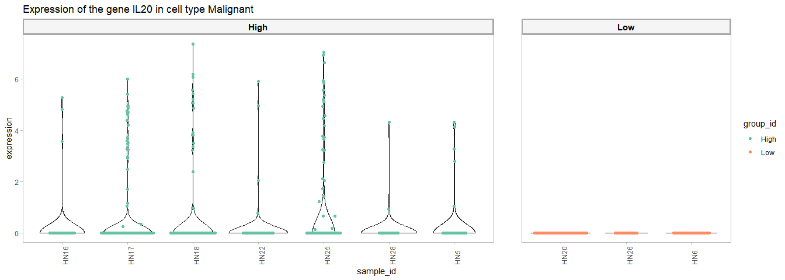
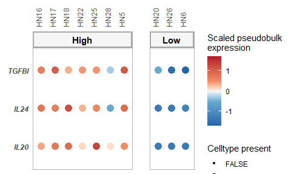

muscatWrapper Visualization Preparation
================
Robin Browaeys
2021-12-13

<!-- github markdown built using 
rmarkdown::render("vignettes/visualization_preparation.Rmd", output_format = "github_document")
-->

In this vignette, you can learn how to use `muscatWrapper` only for
visualization and not for DE analysis itself. muscatWrapper
visualization can be performed if you have multi-sample, multi-group
single-cell data. The absolute minimum of meta data you need to have,
are following columns indicating for each cell: the **group**,
**sample** and **cell type**. This vignette is for users who want to
perform the DE analysis in their own way, but still want to use the
muscatWrapper visualizations easily.

As example expression data, we will use data from Puram et al. of the
tumor microenvironment in head and neck squamous cell carcinoma (HNSCC)
\[See @puram\_single-cell\_2017\]
[](https://doi.org/10.5281/zenodo.5196144).
The groups we have here are tumors scoring high for a partial
epithelial-mesenschymal transition (p-EMT) program vs low-scoring
tumors.

The different steps of the MultiNicheNet analysis are the following:

-   0.  Preparation of the analysis: load packages, read in the
        single-cell expression data, and read in geneset of interest

-   1.  Prepare muscatWrapper-specific objects needed for visualization

-   2.  Gene expression visualization

In this vignette, we will demonstrate all these steps in detail.

# Step 0: Preparation of the analysis: load packages, read in the single-cell expression data, and read in geneset of interest

IMPORTANT: The current implementation of the muscat wrapper starts from
a SingleCellExperiment object, therefore we will need to load the
SingleCellExperiment library. If you start from a Seurat object, you can
convert it easily to a SingleCellExperiment via
`sce = Seurat::as.SingleCellExperiment(seurat_obj, assay = "RNA")`.

``` r
library(SingleCellExperiment)
library(dplyr)
library(ggplot2)
library(muscatWrapper)
```

In this case study, we want to study differences in expression between
pEMT-high and pEMT-low tumors. The meta data columns that indicate the
pEMT status of tumors are ‘pEMT’ and ‘pEMT\_fine’, cell type is
indicated in the ‘celltype’ column, and the sample is indicated by the
‘tumor’ column.

**User adaptation required**

``` r
sce = readRDS(url("https://zenodo.org/record/5196144/files/sce_hnscc.rds"))
scater::plotReducedDim(sce, dimred = "UMAP", colour_by = "celltype")
```

<!-- -->

``` r
scater::plotReducedDim(sce, dimred = "UMAP", colour_by = "tumor")
```

<!-- -->

``` r
scater::plotReducedDim(sce, dimred = "UMAP", colour_by = "pEMT")
```

<!-- -->

``` r
scater::plotReducedDim(sce, dimred = "UMAP", colour_by = "pEMT_fine")
```

<!-- -->

Now we will define in which metadata columns we can find the **group**,
**sample** and **cell type** IDs

For the group\_id in this vignette, we choose the ‘pEMT’ column instead
of ‘pEMT\_fine’.

Because DE analysis is here done with another tool than muscatWrapper,
the **list of genes** to visualize should be given here as well

**User adaptation required**

``` r
sample_id = "tumor"
group_id = "pEMT"
celltype_id = "celltype"
geneset = c("IL20","IL24","TGFBI") ## user input required!!! eg from DE analysis with another tool
```

# Step 1: Prepare muscatWrapper-specific objects needed for visualization

We will now calculate the cell type abundance table and make the
visualizations:

``` r
abundance_output = get_abundance_info(sce, sample_id, group_id, celltype_id, min_cells = 10, covariates = NA)
```

``` r
celltype_info = get_expression_info(sce = sce, sample_id = sample_id, group_id = group_id, celltype_id = celltype_id, covariates = NA)
```

# Step 2: Gene expression visualization

Visualize the expression of some DE genes: here as example: genes higher
in the pEMT high tumors in the Malignant cell type

``` r
celltype_oi = "Malignant"
group_oi = "High"
```

First, make a violin plot

``` r
gene_oi = geneset[1]

violin_plot = make_DEgene_violin_plot(sce = sce, gene_oi = gene_oi, celltype_oi = celltype_oi, group_id = group_id, sample_id = sample_id, celltype_id = celltype_id)
violin_plot
```

<!-- -->

Then a Dotplot

``` r
dotplots = make_DEgene_dotplot_pseudobulk(genes_oi = geneset, celltype_info = celltype_info, abundance_data = abundance_output$abundance_data, celltype_oi = celltype_oi)
dotplots$pseudobulk_plot 
```

<!-- -->

``` r
dotplots$singlecell_plot
```

<!-- -->
\#\# References

Puram, Sidharth V., Itay Tirosh, Anuraag S. Parikh, Anoop P. Patel,
Keren Yizhak, Shawn Gillespie, Christopher Rodman, et al. 2017.
“Single-Cell Transcriptomic Analysis of Primary and Metastatic Tumor
Ecosystems in Head and Neck Cancer.” Cell 171 (7): 1611–1624.e24.
<https://doi.org/10.1016/j.cell.2017.10.044>.
